<h1 align="center">C H I L L A X FAQs</h1>
<div align="center">
        
    <h3 align="center">
            <a href="https://vencord.dev/">Vencord Edition</a>
    </h3>
</div>

### 1. How to change the background/background image of CHILLAX?

The steps are first `settings`, then go to the `VENCORD` Section and then `Themes`.
Finally, click `Edit Quick CSS` which should open integrated
[Monaco](https://microsoft.github.io/monaco-editor/) (*Its already there not need
for installation as this is part of the Vencord itself*) code editor.
Now using this Editor, you can easily edit css with hot reloading.
See the below-attached screenshots:

1. 

2. 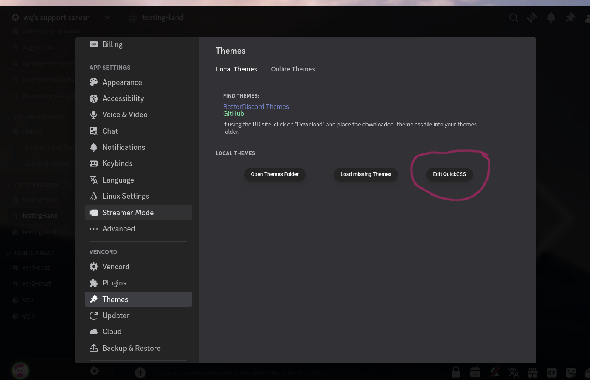

3. 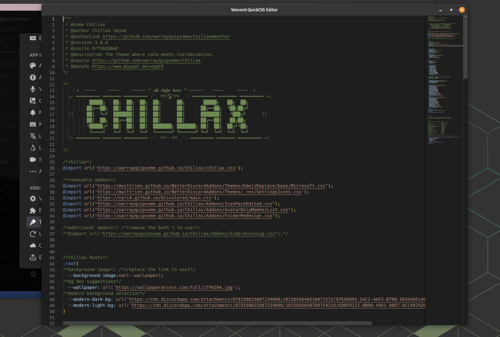

Now to go to line number `46` (*at the time of writing, the line number
is 46 which in a later version might change*) or where the variable `--wallpaper`
defined and change the url that is within the single quote `''`
to the wallpaper/gif **url** that you want to set.

See the below screenshots:

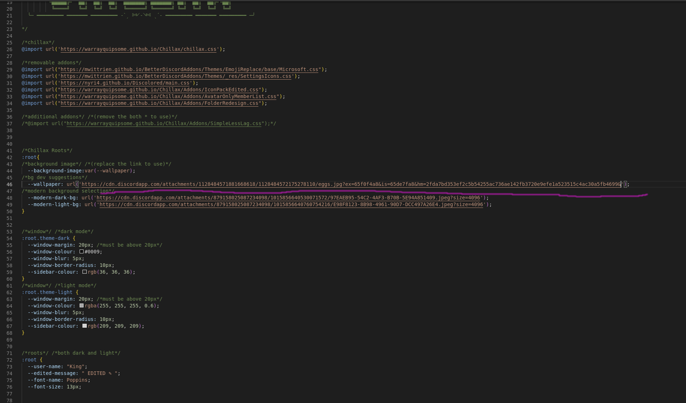

Now your favourite background image/gif should be applied.

> [!IMPORTANT]
> **Note**: If you are using discord CDN, they expire after some time.
> In such cases fetch a new link.

### 2. How to change/use another font(s)?

First, make sure that the font you are trying to
use is already hosted somewhere if it's not already.
Most of the time you will be using [google fonts](https://fonts.google.com/).
From there, choose the font you are looking for and adjust all the settings
and everything (font weights, size etc.) and then copy the css import url.
See the below screenshots:

1. 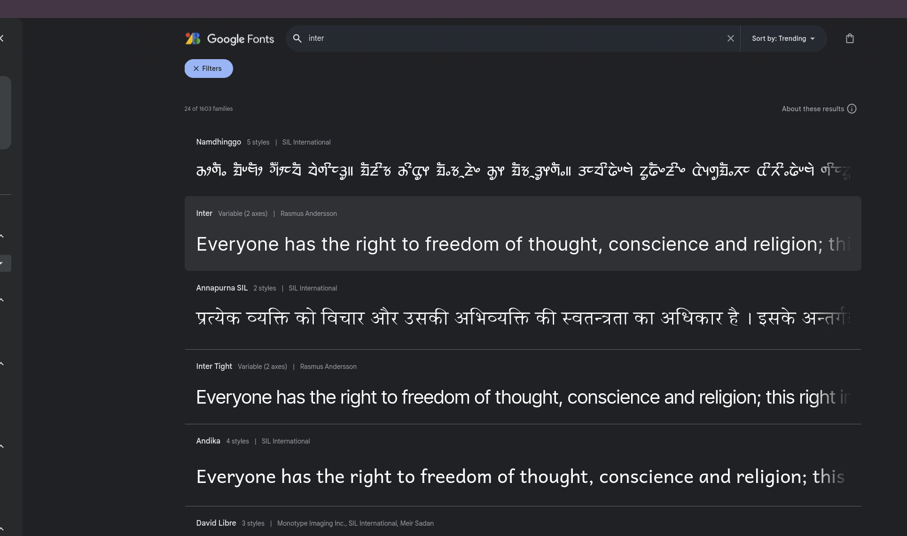

2. 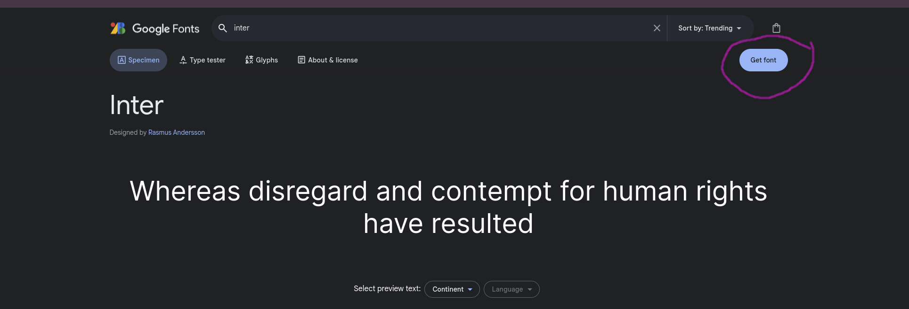

3. 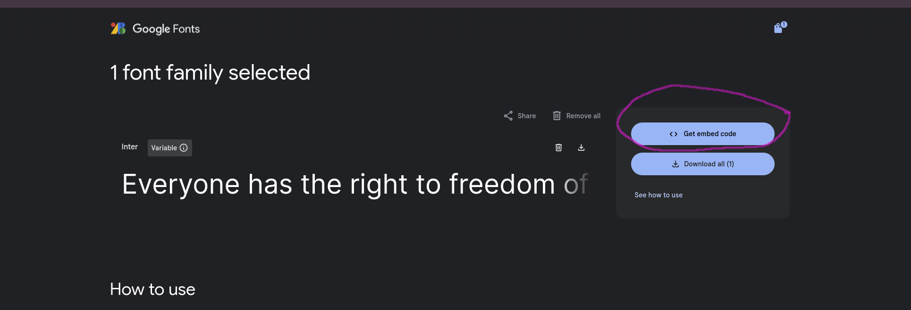

4. 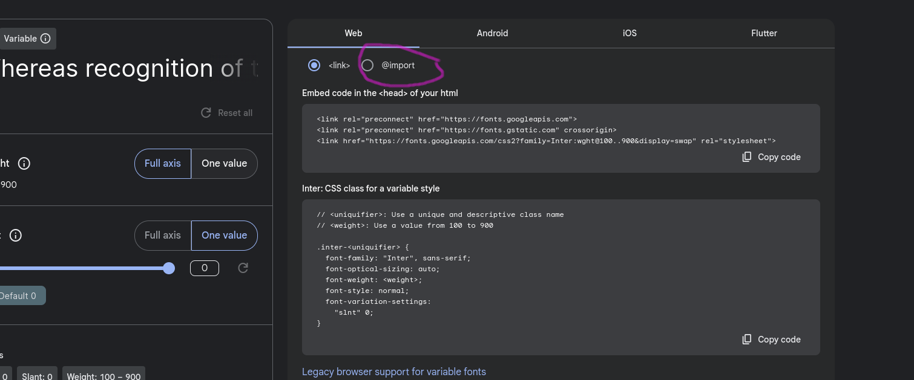

5. 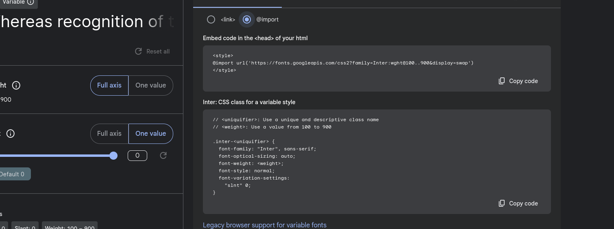

6. 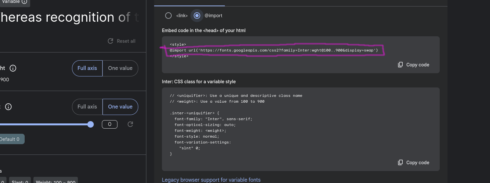

    * Only copy the highlighted part.
      In your case, the link maybe different.

7. 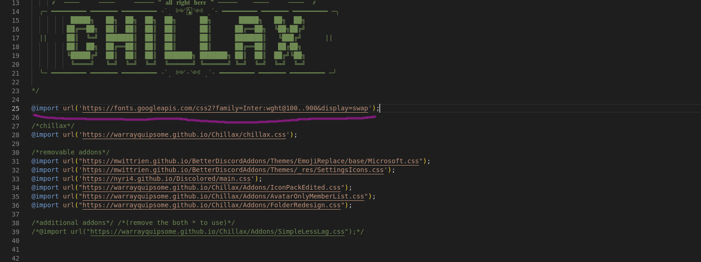

    * Now go to `Settings` > `Themes` > `Edit Quick CSS`.

    * Paste the copied link at the top just like the above screenshot and put the `;` at the end of it.

8. 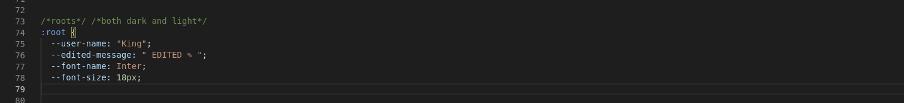

    * Now change the `--font-nane` to the name of the font that you have
      just imported.

    * Optionally adjust the `--font-size` if you need to.

And now the new fonts should be applied.

#### Alternatively, if you want to use a downloaded font:

* Host the font somewhere. [GitHub](https://www.github.com) is a good place.

* For GitHub, all you have to do is create a new repo and upload the font there.

* After clicking on the font file and get the **RAW** link of that.

* Now just like in the previous step 7, we import the font, but this time
  use the **RAW** GitHub link instead of the Google font approach.

```css
    @import url('https://fonts.googleapis.com/css2?family=Inter:wght@100..900&display=swap');
```

instead, it will be

```css
    @font-face {
        font-family: "Font Name"; /* Replace with the name of the font here */
        src: url("RAW GitHub Link"); /* Replace with the hosted github raw link*/
    }
```

### 3. How to change the font size?

* Go to `Settings` > `Themes` > `Edit Quick CSS`.

* Find the css variable `--font-size` and change it to your needs.

That's it.

### 4. How to change the accent color (*The Below **RED** thing/part* see attached screenshot)?

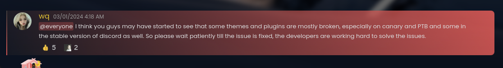

* Go to `Settings` > `Themes` > `Edit Quick CSS`.

* Find the css variables `--accentcolor`, `--accentcolor2` and change them to your needs.

* You may want to play around with them to find the right balance.

> [!IMPORTANT]
> Must-need to change both for it to take full effect.
>
> **Note**: `--accentcolor` is for [rgb](https://rgbcolorpicker.com/) and `--accentcolor2` is
> for [hex](https://colors-picker.com/hex-color-picker/).

### 5. How to change the theme welcome username?

* Go to `Settings` > `Themes` > `Edit Quick CSS`.

* Find the css variables `--user-name` and change it.

### 6. How to make it so that desktop `wallpaper/wallpaper engine's` wallpaper is visible through?
> [!WARNING]
> **We recommend you to not go for that**

However, if you have decided to make up your mind then

* Go to `Settings` > `Vencord` > `Enable Window Transparency` and turn it on.

* Now `Settings` > `Themes` > `Edit Quick CSS` and remove `--wallpaper` css variable
  mentioned in [here](#2-how-to-changeuse-another-fonts).

* Your window should now be `transparent` or `see through` etc.

* Now you may want to add a bit of blur to make things readable in the `container__037ed`.
  However, discord uses electron, and we have found it to work differently on different
  OS and window manager of your OS also plays a vital role here.
  So, the below css snippet may or may not work properly (Translucence is enabled in
  window manager level).
  In case it does not work, it will at least make the `container__037ed`
  basically that region a bit darker.
  ```css
    .container__037ed {
          background-color: rgba(255, 255, 255, 0) !important; /* Semi-transparent white for light theme */
          /* Or use this for dark theme: background-color: rgba(0, 0, 0, 0.1); */
          backdrop-filter: blur(1px) !important; /*Blur the background*/
          border-radius: 10px; /* Rounded corners */
          /* Or use this for dark theme: border: 1px solid rgba(0, 0, 0, 0.2); */
          box-shadow: 0 8px 32px 0 rgba(31, 38, 135, 0.37) !important; /* Optional: Add a box shadow for depth */
    }
  ```

> [!important]
> **Note**: *Linux users this may be a hit or miss due to infinite number of factors
> (Too many DEs, WMs & Display Protocols).*
> But using WM you can **natively add/force** translucence
> at window level
> (i.e. [hyprland](https://hyprland.org/) {**wayland warning
> **}, [qtile](https://qtile.org/), [KWin](https://userbase.kde.org/KWin) etc.),
> and you won't have to do any of the above-mentioned things.

### 7. How to change the font of the group chat?

* We have already mentioned how you can import a custom font and
  use it [here](#2-how-to-changeuse-another-fonts).

* Now use the below css snippet (*pate it at the **very bottom***) by @LofiTurtle:
>    [!NOTE]
>      If the below css does not work,
>      then please create an [Issue](https://github.com/warrayquipsome/Chillax/issues) or report in
>      the [Support Discord Server](https://discord.gg/DrfX6286kF).

  ```css
    /* Reset groupchat name font */
    .input_f8b740 {
        font-family: var(--font-name) !important; /* Write the font name here */
        font-weight: inherit !important; /* Self explanatory */
    }
  ```
* If you want, you can replace `var(--font-name)` with your custom font name
  if you are planning on using multiple fonts at once.

### 8. CHILLAX is laggy or slow, very slow, any fix?

* Make sure that **Hardware Acceleration** is on.
  If not, then turn it on.

* The steps are first `settings`, then `Advance` and then turn on `Hardware Acceleration`.

*Almost 99% of the time this is the reason behind lag.*

If you are on a system that is not older than 5 years,
the theme should work fine without any lag.

However, as a last resort you can

* The steps are first `Settings`, then go to the `Themes` Section and then `Edit Quick CSS`.

* [Uncomment](https://developer.mozilla.org/en-US/docs/Web/CSS/Comments) line `37` different/or which
  says `/*@import url("https://warrayquipsome.github.io/Chillax/Addons/SimpleLessLag.css");*/`
  See the below screenshots:

1.  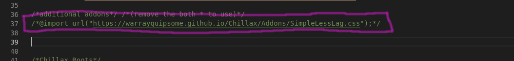

    * Uncomment this line, and it should look something like the below
      screenshot:

2.  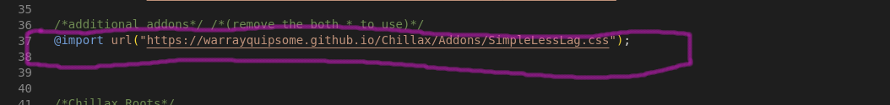

* This should make it a little less laggy.

Consequently, you can try out [OpenAsar](https://openasar.dev/) which is part
of the [Vencord installer](https://github.com/Vencord/Installer/issues/11).
This should give a bit more performance boost.

### 9. How to make the member list always stay visible instead of on hover?

This is basically an addon; to remove it:

* The steps are first `Settings`, then go to the `Themes` Section and then `Edit Quick CSS`.

* **Remove** or **comment out** the line (*currently line number `33` and maybe different in your case*) containing
  `@import url("https://warrayquipsome.github.io/Chillax/Addons/AvatarOnlyMemberList.css");`.
  Now the member list will always be visible instead of on hover.
  See the below screenshots:

1.  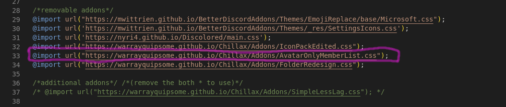

    * Now remove/comment out this line.

2.  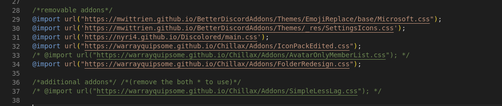

    * Finally, you should have something like this:

3.  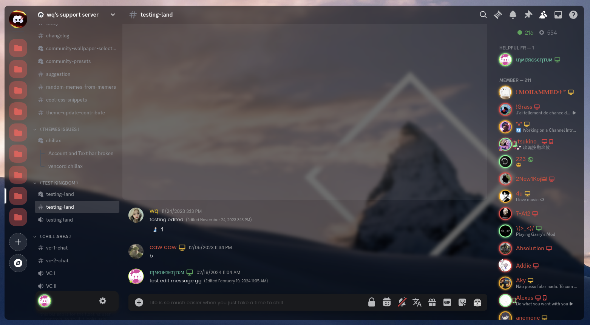

### 10. How to get back the old emojis?

This is also very similar to the previous [FAQ](#8-how-to-make-the-member-list-always-stay-visible-instead-of-on-hover).
This thing is also an addon.
Remove it to get back default emojis:

* The steps are first `Settings`, then go to the `Themes` Section and then `Edit Quick CSS`.

* **Remove** or **comment out** the line (*currently line number `29` and maybe different in your case*) containing
  `@import url("https://mwittrien.github.io/BetterDiscordAddons/Themes/EmojiReplace/base/Microsoft.css");`.

* Now you should have the old emojis.

### 11. How to get rid of the Folder Icons and Make it like the old discord?

* The steps are first `Settings`, then go to the `Themes` Section and then `Edit Quick CSS`.

* **Remove** or **comment out** the line (*currently line number `34` and maybe different in your case*) containing
  `@import url("https://warrayquipsome.github.io/Chillax/Addons/FolderRedesign.css");`.

* Now it should be normal like the old discord.

### 12. How to get rid of the below-attached ugly thing?

<div align="center">
    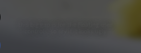
</div>

* The steps are first `Settings`, then go to the `Themes` Section and then `Edit Quick CSS`.

* Now the use/paste below css snippet by @LofiTurtle at the very end:

> [!NOTE]
> If the below css does not work,
> then please create an [Issue](https://github.com/warrayquipsome/Chillax/issues) or report in
> the [Support Discord Server](https://discord.gg/DrfX6286kF).

If you are using dark mode, then the below css snippet
```css
    /* hide message in the sidebar when using dark mode */
    .theme-dark .sidebar_a4d4d9 .content_eed6a8:after {
        color: rgba(255, 255, 255, 0) !important;
        text-shadow: none !important;
    }
```

Or, if you are using light mode, then the below css snippet

```css
    /* hide message in the sidebar when using light mode */
    .theme-light .sidebar_a4d4d9 .content_eed6a8:after {
        color: rgba(255, 255, 255, 0) !important;
        text-shadow: none !important;
    }
```

* Now it should be a bit better.

### 13. How to use dark/light mode in Chillax Theme?

You can enable both dark/light mode from the Settings.
appearance

* Now go to `Settings` > `Appearance`.

* Finally, choose either light mode or dark mode based on your preference
  and Chillax will reflect that.

### 14. After applying Chillax theme it looks funny and/or transparent/see through background is missing, what to do?

Before applying the theme:

* Firstly, make sure that there is **no custom** css or css snippet(s) is/are running.

* Secondly, make sure that no party plugin related to theming
  is running (*if debugging, disable all plugins for quicker conclusion*).

* Thirdly, `Settings` > `Appearance` is set to either Dark or light mode.

* Now apply the Latest version
  of [Chillax](https://raw.githubusercontent.com/warrayquipsome/Chillax/main/chillax.theme.css).

* Now you should have Chillax with the default look and feel.


### 15. How to get rid of the mobile icon besides the avatar?

* The steps are first `Settings`, then go to the `Themes` Section and then `Edit Quick CSS`.

* Now to the line `92` or find the line that says `--rs-phone-visible: block;` and
  change this line to the below line:

    ```css
        --rs-phone-visible: none;
    ```

* Now mobile icon or phone icon should be gone.

&#160;

<h1 align="center">Still Have Question(s)? 👇</h1>
<div align="center">
    <a href="https://discord.gg/DrfX6286kF" target="_blank">
        
    </a>
</div>

<p align="center">Copyright &copy; 2024-present 
   <a href="https://github.com/warrayquipsome" target="_blank">Wq</a>
</p>
